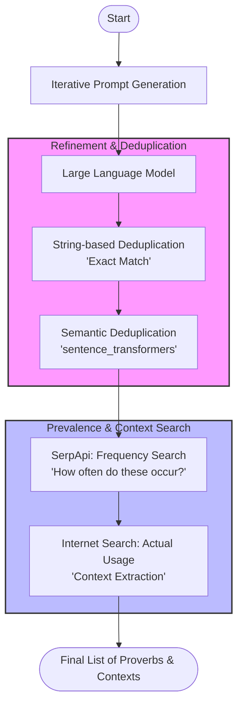

# Workflow

Here’s the diagram:

```mermaid
graph TD
    Start([Start]) --> Prompts[Iterative Prompt Generation]
    Prompts --> LLM[Large Language Model]
    
    subgraph Refinement [Refinement & Deduplication]
        LLM --> StringDedup[String-based Deduplication<br/>'Exact Match']
        StringDedup --> SemanticDedup[Semantic Deduplication<br/>'sentence_transformers']
    end
    
    subgraph Verification [Prevalence & Context Search]
        SemanticDedup --> SerpAPI[SerpApi: Frequency Search<br/>'How often do these occur?']
        SerpAPI --> UsageSearch[Internet Search: Actual Usage<br/>'Context Extraction']
    end
    
    UsageSearch --> Results([Final List of Proverbs & Contexts])

    %% Styling
    style Refinement fill:#f9f,stroke:#333,stroke-width:2px
    style Verification fill:#bbf,stroke:#333,stroke-width:2px
  
```
